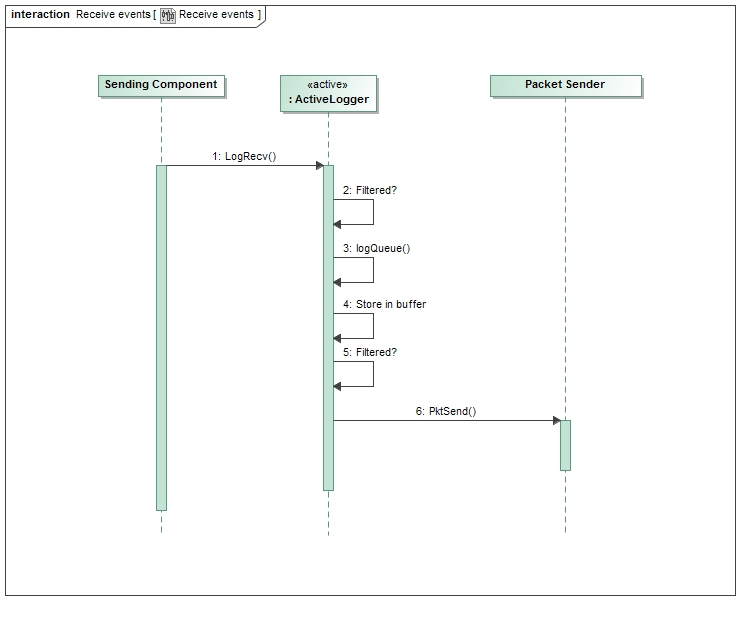

# Svc::ActiveLogger Component

## 1. Introduction

The `Svc::ActiveLogger` component processes events from other components. The events are put in packets and sent to an external user like a ground system. The component provides event filtering and writing event logs to a file.

## 2. Requirements

The requirements for `Svc::ActiveLogger` are as follows:

Requirement | Description | Verification Method
----------- | ----------- | -------------------
AL-001 | The `Svc::ActiveLogger` component shall queue events and compose them into downlink packets. | Inspection; Unit Test
AL-002 | The `Svc::ActiveLogger` component shall have commands to filter events based on event severity. | Unit Test
AL-003 | The `Svc::ActiveLogger` component shall filter events based on the event ID. | Unit Test 

## 3. Design

### 3.1 Context

#### 3.1.1 Component Diagram

The `Svc::ActiveLogger` component has the following component diagram:

#### 3.1.2 Ports

The `Svc::ActiveLogger` component uses the following port types:

Port Data Type | Name | Direction | Kind | Usage
-------------- | ---- | --------- | ---- | -----
[`Fw::Log`](../../../Fw/Log/docs/sdd.html) | LogRecv | Input | Synchronous | Receive events from components
[`Fw::Com`](../../../Fw/Log/docs/sdd.html) | PktSend | Output | n/a | Send event packets to external user
[`Svc::FatalEvent`](../../../Svc/Fatal/docs/sdd.html) | FatalAnnounce | Output | n/a | Send FATAL event (to health)

### 3.2 Functional Description

The `Svc::ActiveLogger` component provides an event logging function for the software. The framework autocoder allows developers to specify a set of events in the component XML (see User's Guide). For those components, the autocoder will add an `Fw::Log` output port to send events in serialized form. The ActiveLogger filters the events and sends them as packets to other components that send them out of the system.

NOTE: Event ID value 0 is reserved for the logger.

#### 3.2.1 Filtering

The `Svc::ActiveLogger` `LogRecv` input port handler filters events on the thread of the caller to lessen the CPU load caused by sending events via IPC to the component thread. The filters can be set by severity. By default, the DIAGNOSTIC events are filtered since the number can be the highest and are typically only used for development and debugging. This filter is modified by the `SET_EVENT_FILTER` command.

The thread of the component retrieves the log events from the message queue and converts them to a packet and sent via the `PktSend` port.

The component also allows filtering events by event ID. There is a configuration parameter that sets the number of IDs that can be filtered. This allows operators to mute a particular event that might be flooding the event queue. This filter can be set on either receipt of the event or prior to sending the event. In most cases, it is desirable to filter on receipt so a flooding event does not overwhelm the message queue. These filters is modified by the `SET_EVENT_ID_REPORT_FILTER` and `SET_EVENT_ID_SEND_FILTER` command.

FATAL events are never filtered, so they can be caught by the system.

#### 3.2.2 Fatal Announce

When the `ActiveLogger` component receives a FATAL event, it calls the FatalAnnounce port. Another component that has a system response to FATALs (such as reset) can connect to the port to be informed when a FATAL has occurred.

### 3.3 Scenarios

#### 3.3.1 Receive Events

The `Svc::ActiveLogger` component accepts events from other components:

 

### 3.4 State

`Svc::ActiveLogger` has no state machines, but stores the state of the event severity and event ID filters.

### 3.5 Algorithms

`Svc::ActiveLogger` has no significant algorithms.

## 4. Dictionaries

Dictionaries: [HTML](ActiveLogger.html) [MD](ActiveLogger.md)

## 5. Module Checklists

Document | Link
-------- | ----
Design Checklist | [Link](Checklist_Design.xlsx)
Code Checklist | [Link](Checklist_Code.xlsx)
Unit Test Checklist | [Link](Checklist_Unit_test.xlsx)

## 6. Unit Testing

[Unit Test Output](../test/ut/output/test.txt)

[Coverage Output - `ActiveLoggerImpl.cpp`](../test/ut/output/ActiveLoggerImpl.cpp.gcov)

[Coverage Output - `ActiveLoggerComponentAc.cpp`](../test/ut/output/ActiveLoggerComponentAc.cpp.gcov)

[Report](../test/ut/output/SvcActiveLogger_gcov.txt)

## 7. Change Log

Date | Description
---- | -----------
6/25/2015 | Design review edits
7/22/2015 | Design review actions
9/7/2015 | Unit Test updates 
10/28/2015 | Added FATAL announce port
12/1/2020 | Removed event buffers and post-filter

