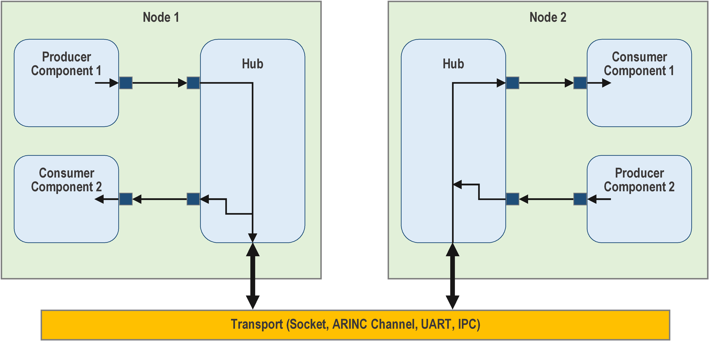

# A Quick Look at the Hub Pattern

A hub is a component with multiple serialization input and output ports.
Typed ports on calling components are connected to serialized ports, as
previously shown in Figure 3. A single point of connection to a remote
node is essential for a central point of configuration transport, as
shown in Figure 9.

**Figure 9. Hub pattern.** Each hub instance is responsible for
connecting to a remote node. Input port calls are repeated to
corresponding output ports on a remote hub. These hubs have been
demonstrated on Sockets, ARINC 653 Channels, High-speed hardware bus
between nodes, and UARTs between nodes in an embedded system.